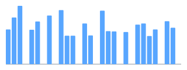

### Hi there 👋

- 🔭 I'm currently working on go/web3
- 🚲 Amateur cyclist! Follow me on 👉 [strava](https://www.strava.com/athletes/136584058)
- 📫 How to reach me: equationzhao@foxmail.com
- 🌍 Welcome to https://blog.equationzhao.space

## Strava Profile

<!-- STRAVA_PROFILE:START -->
### 🚴 Equation💨 赵方程
> 好的方程列出来有诗的美感
📍 上海, Hong Kong

#### 📊 Lifetime Stats
| | Ride | Run |
| --- | --- | --- |
| Distance | 13977.9 km | 454.7 km |
| Time | 580h 52m | 58h 33m |
| Activities | 719 | 205 |
| Elevation Gain | 65.9 km | 3.2 km |

#### 🏆 Personal Records
- 🚴 Longest Ride: 171.9 km
- ⛰️ Biggest Climb: 0.8 km
<!-- STRAVA_PROFILE:END -->

## Intervals.icu

<!-- INTERVALS_ICU:START -->
**Last 7 days:** 5 activities · 417.7 km · 15h34m · Load 762

| Date | Activity | Type | Distance | Time | Elevation | Load |
| --- | --- | --- | --- | --- | --- | --- |
| 2026-02-18 | 鳌江三个坡 | Ride | 60.3 km | 2h43m | 1088 m | 150 |
| 2026-02-17 | 🐎 | Ride | 72.2 km | 2h29m | 617 m | 121 |
| 2026-02-15 | 168 | Ride | 135.2 km | 5h02m | 1674 m | 205 |
| 2026-02-14 | 闹村 | Ride | 74.0 km | 2h43m | 837 m | 164 |
| 2026-02-13 | 瞎骑溜达 | Ride | 76.0 km | 2h35m | 682 m | 122 |
<!-- INTERVALS_ICU:END -->

## Cycling results

- 2025 Giant 骑行盛典 U25 — P43
- 2025 Hainan UCI Granfondo World Series S1 — P24
- 2025 Hainan UCI Granfondo World Series S2 — P14
- 2025 Hainan UCI Granfondo World Series S3 — P21

## Race calendar

- 2026 凤凰菲尼斯环浙步道 HEROS 开化站 — 29 Mar 2026
- 2nd UCI Gran Fondo Hangzhou — 23–24 May 2026
- UCI Gran Fondo World Championships (Niseko, Japan) — 26–30 Aug 2026

# Github state

<a href="https://next.ossinsight.io/widgets/official/compose-user-dashboard-stats?user_id=75521101" target="_blank" style="display: block" align="center">
  <picture>
    <source media="(prefers-color-scheme: dark)" srcset="https://next.ossinsight.io/widgets/official/compose-user-dashboard-stats/thumbnail.png?user_id=75521101&image_size=auto&color_scheme=dark" width="771" height="auto">
    
  </picture>
</a>
