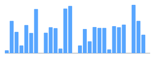

### Hi there 👋

- 🔭 I'm currently working on go/web3
- 🚲 Amateur cyclist! Follow me on 👉 [strava](https://www.strava.com/athletes/136584058)
- 📫 How to reach me: equationzhao@foxmail.com
- 🌍 Welcome to https://equationzhao.github.io

## Strava Profile

<!-- STRAVA_PROFILE:START -->
### 🚴 🦵🧨 赵方程
> 好的方程列出来有诗的美感
📍 上海, Hong Kong

#### 📊 Lifetime Stats
| | Ride | Run |
| --- | --- | --- |
| Distance | 24420.4 km | 474.6 km |
| Time | 928h 10m | 60h 46m |
| Activities | 900 | 208 |
| Elevation Gain | 101.9 km | 3.3 km |

#### 🏆 Personal Records
- 🚴 Longest Ride: 315.3 km
- ⛰️ Biggest Climb: 0.9 km
<!-- STRAVA_PROFILE:END -->

## Intervals.icu

<!-- INTERVALS_ICU:START -->
**Last 7 days:** 6 activities · 342.3 km · 10h44m · Load 513

| Date | Activity | Type | Distance | Time | Elevation | Load |
| --- | --- | --- | --- | --- | --- | --- |
| 2026-08-20 | 基础训练 | VirtualRide | 41.7 km | 1h20m | - | 35 |
| 2026-08-19 | Z2 | Ride | 77.3 km | 2h10m | - | 97 |
| 2026-08-18 | Over/Under | Ride | 62.4 km | 2h03m | - | 147 |
| 2026-08-17 | 室内骑行 | VirtualRide | 17.8 km | 49m | - | 13 |
| 2026-08-16 | Z2 Endurance | VirtualRide | 89.4 km | 2h30m | - | 96 |
<!-- INTERVALS_ICU:END -->

## Cycling results

- 2025 Giant 骑行盛典 U25 — P43
- 2025 Hainan UCI Granfondo World Series S1 — P24
- 2025 Hainan UCI Granfondo World Series S2 — P14
- 2025 Hainan UCI Granfondo World Series S3 — P21
- 2026 凤凰菲尼斯环浙步道 HEROS 开化站 - NDF(Crashed)
- 2nd UCI Gran Fondo Hangzhou — DNS

## Race calendar

None

# Github state

<a href="https://next.ossinsight.io/widgets/official/compose-user-dashboard-stats?user_id=75521101" target="_blank" style="display: block" align="center">
  <picture>
    <source media="(prefers-color-scheme: dark)" srcset="https://next.ossinsight.io/widgets/official/compose-user-dashboard-stats/thumbnail.png?user_id=75521101&image_size=auto&color_scheme=dark" width="771" height="auto">
    
  </picture>
</a>
