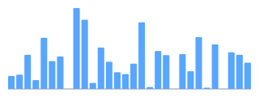

### Hi there 👋

- 🔭 I'm currently working on go/web3
- 🚲 Amateur cyclist! Follow me on 👉 [strava](https://www.strava.com/athletes/136584058)
- 📫 How to reach me: equationzhao@foxmail.com
- 🌍 Welcome to https://equationzhao.github.io

## Strava Profile

<!-- STRAVA_PROFILE:START -->
### 🚴 🦵🧨 赵方程
> 好的方程列出来有诗的美感
📍 上海, Hong Kong

#### 📊 Lifetime Stats
| | Ride | Run |
| --- | --- | --- |
| Distance | 29313.2 km | 503.0 km |
| Time | 1108h 17m | 64h 4m |
| Activities | 1,001 | 215 |
| Elevation Gain | 150.4 km | 3.4 km |

#### 🏆 Personal Records
- 🚴 Longest Ride: 315.3 km
- ⛰️ Biggest Climb: 1.0 km
<!-- STRAVA_PROFILE:END -->

## Intervals.icu

<!-- INTERVALS_ICU:START -->
**Last 7 days:** 16 activities · 389.8 km · 15h29m · Load 575

| Date | Activity | Type | Distance | Time | Elevation | Load |
| --- | --- | --- | --- | --- | --- | --- |
| 2026-11-14 | 杨浦区 公路骑行 | Ride | 24.1 km | 1h20m | 52 m | 9 |
| 2026-11-13 | MyWhoosh - Endurance @62% \| 3h \| W02 | VirtualRide | 71.2 km | 3h01m | 1705 m | 112 |
| 2026-11-13 | Evening Ride | Ride | 2.1 km | 7m | 9 m | 0 |
| 2026-11-13 | Afternoon Ride | Ride | 2.1 km | 6m | 4 m | 1 |
| 2026-11-13 | Lunch Ride | Ride | 2.0 km | 6m | 1 m | 2 |
<!-- INTERVALS_ICU:END -->

## Cycling results

- 2025 Giant 骑行盛典 U25 — P43
- 2025 Hainan UCI Granfondo World Series S1 — P24
- 2025 Hainan UCI Granfondo World Series S2 — P14
- 2025 Hainan UCI Granfondo World Series S3 — P21
- 2026 凤凰菲尼斯环浙步道 HEROS 开化站 - NDF(Crashed)
- 2nd UCI Gran Fondo Hangzhou — DNS

## Race calendar

None

# Github state

<a href="https://next.ossinsight.io/widgets/official/compose-user-dashboard-stats?user_id=75521101" target="_blank" style="display: block" align="center">
  <picture>
    <source media="(prefers-color-scheme: dark)" srcset="https://next.ossinsight.io/widgets/official/compose-user-dashboard-stats/thumbnail.png?user_id=75521101&image_size=auto&color_scheme=dark" width="771" height="auto">
    
  </picture>
</a>
